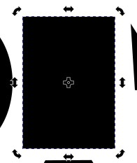

# Tutoriel inkscape

 Pourquoi un tutoriel Inkscape de plus ? Celui ci se veut à destination des personnes utilisant ce logiciel pour le pilotage de machine type fablab (Découpeuse laser, plotter de découpe, ...)


Pourquoi utiliser un logiciel de dessin vectoriel pour concevoir des pièces à usiner ?
Les logiciels controllant les machines ont besoin de générer des trajectoires précises. Cela n'est pas possible avec des images matricielles, en effet ce qui est enregistré dans une image matricielle est la couleur de chaque pixel et non une forme. Quand on dessine un rond dans une image matricelle l'information que c'est un rond n'est pas garder, c'est juste un ensemble de points avec une certaine couleur que notre cerveau réinterprête comme un rond.

Quand on utilise un outil de dessin vectoriel c'est l'information de la forme qui est enregistré. Cela permet de modifier la taille à l'infini sans pixélisation. Dans notre cas cela permet au logiciel des machines de générer des trajectoires d'outils car ils ont a leur disposition toutes les informations nécessaires pour cela.


Si vous ouvrez un fichier SVG avec un éditeur de texte voici ce que vous pouvez y trouver:
```
<ellipse
   style="fill:#000000;stroke:none;fill-opacity:1"
   id="path1"
   cx="50.000"
   cy="70.000"
   rx="20.000"
   ry="20.000" />

```
Ceci défini une ellipse avec un rayon x de 20mm et un rayon y de 20mm (un cercle), elle est positionnée à 50 mm du bord droit et 70 mm du haut. Ensuite sur la partie visuelle, une forme vectoriel est défini par sa couleur remplissage (fill) et son contour (stroke) qui a une couleur et une épaisseur. Ici l'ellipse est remplie en noir et mais n'a pas de contour.

## Configuration de inkscape


La première chose à faire après avoir installé inkscape est d'aller dans les préférences (**Édition => Préférences**), sélectionné **Outils** et choisir la **Boîte englobante géométrique**.

**Pourquoi passer de boite englobante visuelle à boîte englobante géométrique ?**

La difficulté apparait quand vous ajoutez des contours à vos formes. Le centre du contour se positionne pile sur le chemin de la forme. Par exemple pour un rectangle de 20mm de haut et un contour de 1mm, il y a 0.5mm de contour vers l’intérieur du rectangle et 0.5mm vers l'extérieur du rectangle.


La **boite englobante visuelle** va se situer à l'extérieur du contour. Par exemple pour un rectangle de 20mm de côté et de contour 1mm, la boite englobante visuelle mesurera 21mm (20+0.5*2). Nous le verrons plus tard ceci peut amener à des erreurs de dimensionnement et de placement.


La **boite englobante géométrique** correspond au dimension de la forme quelque soit l'épaisseur de son contour. Par exemple pour un carré de 100mm de côté et de contour 1mm, la boite englobante visuelle mesurera 100mm. Idem si le contour est de 5mm.


## Interface Inkscape


Ci dessus la composition de la fenêtre de Inkscape.

- À gauche la barre d'outils
- En haut la barre de contrôle des outils qui change selon l'outil sélectionné
- En haut à droite le contrôle du magnétisme
- À droite le panneau où différentes fonctionnalités s'affichent
- En bas des informations textuelles sur la sélection en cours ou l’affichage d'erreur sur l'utilisation de certaines actions
- Au milieu la page de dessin.


## La page de dessin


Vous pouvez modifier les dimensions de la page dans **Fichier => Propriétés du document...**

Je vous conseil de mettre les dimensions du matériaux que vous allez utiliser. Cela facilite le placement. Par exemple 600x400mm pour une planche de bois pour une découpeuse laser. 

Dans cette fenêtre vous pouvez également changer les unités de l'interface. Je vous conseil de passer sur une unité métrique **mm** ou **cm**.


## Les formes de base

Il est possible de créer rapidement des formes simples avec les outils **rectangle**, **ellipse**, et **étoile/polygone**


Lorsque vous utilisez un de ces outils, la barre de contrôle en haut change afin de modifier les propriétés de l'élément que vous créez. Par exemple pour un rectangle vous pouvez modifier sa hauteur, sa largeur et le rayon de ses angles.


Vous pouvez également dessiner une forme libre avec l'outil plume . Votre forme est alors de type **chemin**.

Vous pouvez modifier le style de votre forme avec le panneau **Fond et contour** (Menu Objet => Fond et contour)


Plusieurs systèmes de colorimétrie existent (RVB, CMJN, ...). À vous de voir celui qui vous convient. Dans la suite du tutoriel nous utiliserons le RVB.
- L'onglet **Fond** vous permet de modifier la couleur de fond de votre forme.
- L'onglet **Contour** vous permet de modifier la couleur du contour de votre forme.
- L'onglet **Style de contour** vous permet de modifier les propriétés de votre contour comme son épaisseur.


## Usage de la souris et sélection

### Zoom et navigation

- Avec le bouton du milieu de la souris vous pouvez déplacer la zone de dessin dans l'interface.
- Avec la molette de la souris vous pouvez zoomer et dézoomer. Le zoom est centrée sur la position de la souris.

### Mode de sélection

#### Clique dans le vide !

Il n'est pas possible de sélectionner une forme si vous cliquez dans une zone vide de la forme. Par exemple si vous cliquez entre les branches d'une étoile. **Vous ne pouvez pas cliquer au centre d'une forme qui n'a pas de fond !** Vous devez cliquer sur le contour. Si la forme n'a ni fond ni de contour, bonne chance ... Il y a deux solutions: la sélectionner avec une boite englobante si vous savez dans quelle zone elle se trouve ou (Ctrl+A) pour tout sélectionner et la voir apparaitre.

#### Mode objet


En **cliquant** une fois sur une forme ou en sélectionnant plusieurs formes, vous êtes en mode de sélection d'objets avec une boite englobante. Vous pouvez modifier la taille et la position de la boite englobante. En modifiant sa taille, les formes à l'intérieur sont redimensionnées en conséquence.



Si vous **re-cliquez** sur la sélection, les flèches se modifieront et vous pourrez faire tourner la boite englobante et les formes à l’intérieure de celle-ci.

Si vous souhaitez sélectionner un élément qui est caché par un autre:
- Cliquez sur l'objet qui recouvre celui qui vous intéresse
- Maintenez la touche (Alt)
- Cliquez une seconde fois sur l'objet du dessus à l'emplacement où se trouve l'objet du dessous.
- L'objet du dessous est sélectionné. Vous pouvez le voir avec le changement de boîte englobante.

#### Mode forme


En double cliquant sur une forme vous repasser dans l'outil de la forme. Dans l'exemple ci dessus, l'outil ellipse avec ses contrôle associés:
- les rayons x et y
- l'angle de début et l'angle de fin si on veut réaliser un arc de cercle


#### Mode noeuds


En double cliquant sur un forme libre, donc un chemin, vous passez en mode noeuds. Vous pouvez modifier le chemin qui constitue la forme:
- Déplacer les noeuds
- Ajouter, supprimer les noeuds
- Courber des lignes


## Placement

### Outil sélection

La première solution pour déplacer des éléments est l'outil de sélection avec sa barre de contrôle associée.


Dans la barre de contrôle, vous pouvez indiquer la position en X et Y de la sélection. 

**TIPS !!!**
**Les opérations mathématiques (+-*/) sont possible directement dans les champs numériques.**

Par exemple, si votre sélection est positionnée à X=33mm, que vous voulez la décalé de 9mm vers la droite, vous pouvez rajouter directement `+9` après le 33  et taper `Entrée`, le calcul se fait automatiquement.

### Le magnétisme
Le second outil très pratique pour des placements précis est le magnétisme.Il peut être activé en cliquant sur l’icône . La flèche à côté permet de contrôler les points qui sont magnétiques. Je conseil d'activer au moins *Boite englobante*, *Noeuds* et *Grille*.
 
### Grille

Vous pouvez afficher une grille sur l'interface de inkscape. Elle est très pratique en combinaison du magnétisme. Cependant il faut la configurer correctement. Vous pouvez aller dans **Fichier => Propriétés du document... => Onglet Grille**. Choisissez bien mm en unité et 1 mm en espacement. La grille a deux niveaux. Par défaut la grille principale correspond à 5 fois l'espacement et la grille secondaire une fois l'espacement (à 1mm). La grille secondaire n'apparait que si vous zoomer suffisamment.

### Aligner et distribuer
Si vous avez besoin d'aligner plusieurs éléments les uns par rapport aux autres, vous pouvez utiliser le panneau **Aligner et distribuer**. Il s'ouvre en allant dans le menu **Objet=>Aligner et distribuer**.


L'option **Relativement à** permet de définir l'élément qui ne bouge pas. La plus part du temps je choisis *Objet le plus grand*.

### Groupement

Il est possible de grouper des formes entre elles, ce qui permet de sélectionner automatiquement le groupe entier quand on clique sur une des formes au lieu de les sélectionner individuellement. Sélectionner les éléments à grouper puis **Menu Objet => Grouper** ou les touches de raccourcis (Ctrl+G). Les groupes sont eux même des éléments groupables.

Si vous double cliquez sur un groupe, vous rentrer dans ce groupe et vous pouvez à nouveau sélectionner chaque élément du groupe. Si vous voulez sortir du groupe vous devez double cliquer à l'extérieur du groupe dans un zone vide.
Si vous voulez sortir de plusieurs groupes imbriqués, vous devrez double cliquer autant de fois à l’extérieur. Donc si vous êtes perdu, double cliquez plein de fois dans une zone vide.

## Transformer

Le panneau Transformer permet d'appliquer différents types de modifications à vos objets. Menu **Objet=>Transformer**.

### Rotation 
Cet outil est indispensable pour effectuer une rotation précise de vos objets.
Il est possible de changer le centre de rotation en déplacent la croix qui est au centre de votre boite englobante quand vous faite deux simples clic sur votre objet.


### Dimensions

L'onglet Dimensions du panneau vous permet de modifier la taille de vos objets. L'option **Appliquer à chaque éléments séparément** est très intéressante si vous voulez redimensionner rapidement plusieurs objets sans changer leur position. 

Une application très concrète, **redimensionner des trous** (cercle):
- Vous sélectionnez tous les cercles que vous souhaitez modifier.
- Vous passez l'unité en mm
- Vous indiquez les nouvelles dimensions de vos trous.
- Vous cochez l'option **Appliquer à chaque éléments séparément**
- Vous appliquez
- Vos trous ont été redimensionnés sans changer de place (centre au même endroit)

## Copier des éléments

### Ctrl+C Ctrl+V
La copie classique. Le centre du nouvel objet se positionnera sous le curseur de la souris.

### Dupliquer

Ctrl+D permet de dupliquer l'objet, sans le déplacer. L'original et la copie se retrouve l'un sur l'autre.

### Créer un pavage de clones

il est possible de crée de nombreuse copie d'un objet sous forme de pavage. Une fois sélectionné l'objet a duplique, aller dans le menu **Édition=>Cloner=>Créer un pavage de clone**


Cette fenêtre vous permet de créer votre pavage. Vous pouvez notamment choisir le nombre de ligne et de colonne de votre pavage. Vous pouvez également appliquer des modifications sur les clones.


Un exemple classique de l'utilisation de l'onglet translation est l'ajout d'un espace entre les clones. En effet par défaut les clones sont collés les uns aux autres. Si vous changer le % sur la translation X pour les colonnes, un espace sera rajouté entre chaque colonne de clones. La distance rajoutée est un % de la taille de l'objet original. 10% d'un objet de 100mm de large va rajouter 10mm entre chaque clone.


**Attention !** Lorsque vous créez un pavage de clone, le premier clone en haut à gauche se superpose à l'original. Pensez à supprimer l'un des deux.


## Opérations sur les chemins


De nombreux opérations peuvent être effectué sur les chemins.

### Objet en chemin
La première option du menu permet de transforme un objet en chemin. Par exemple transformé un forme simple comme le rectangle en chemin. Ceci donne plus de liberté quand aux modifications possibles.

Un autre intérêt est de transformer du **texte en chemin**. Ceci permet de transférer votre fichier vers un autre ordinateur qui ne possède pas la police nécessaire sans perdre le formatage. **Attention cette opération est irréversible**. Il est donc conseillé de garder une version avec le texte toujours en objet de type texte pour de futures modifications.

### Géométrie

Vous pouvez notamment combiner des chemins avec les opérations
- Union
- Différence
- Intersection
- Exclusion
- ....

Si vous appliquez ces opérations sur une forme simple elle sera automatiquement transformé en chemin.

### Vectoriser un objet matriciel

Cette opération permet de passer d'une image matricielle (jpg, bmp, png,...) à un objet vectoriel, donc un chemin. Les images les plus simples à vectoriser sont les images en noir et blanc.

#### Extraire le contour extérieur d'une image vectorisée


Il est parfois intéressant d'extraire le contour extérieur d'une forme complexe afin de pouvoir avoir un second tracer pour la découpe.

- Passez en mode noeuds
- Sélectionnez votre forme
- Maintenez la touche (Ctrl) appuyée
- Positionnez votre souris au dessus d'un nœud du contour extérieur
- Faite tourner la mollette de votre souris
- Arrêtez de tourner la molette quand le nombre de noeuds sélectionnés n'augmente plus
- (Ctrl+C) copie des noeuds sélectionnés
- (S) sortie du mode Noeuds, passage en mode Sélection
- (Ctrl+V) collage des noeuds


Vous avez maintenant un second chemin composé uniquement du contour de la forme. Vous pouvez très facilement les superposer avec l’outil Aligner et distribuer.

### Contour en chemin

Cette fonctionnalité permet de transformer un contour en chemin. Par exemple un trait de 25mm de long avec un contour noir de 5mm d'épaisseur, va se transformer un rectangle de 25mm de long 5mm de hauteur, un fond noir et pas de contour.


Si dessus avant et après.

## Importation de DXF

Les fichiers dxf générer par les logiciels de modélisation 3D sont rarement exploitable directement.

### Mise à l’échelle
La première difficulté est la perte de la bonne échelle. Il est très facile de remètre tous le fichier à la bonne échelle en connaissant la dimension d'une seule forme.

- Sélectionnez la forme dont au moins la longueur ou la largeur est connue. par ex un trou de 3mm
- Copiez la dimension actuelle de la forme (Ctrl+C), ex 2.159 enregistrer dans le presse papier du système
- Sélectionnez tous les éléments du fichier (Ctrl+A)
- Cliquez sur le cadenas entre le champs hauteur et la champs largeur, ceci permet de garder les proportions.
- Dans le champs choisi (hauteur ou largeur) écrivez la valeur actuel `/` la valeur enregistré `*` la valeur voulue , ex `146,48/2.159*3`
- Tapez sur entrer
- Tous le fichier est à la bonne échelle !

Attention sous MAC, il faut bien utiliser (CTRL+C/V) et non (Cmd+C/V)

### Simplifier

Il est possible que le chemin gérer par le logiciel 3D soit composer d'un nombre très important de point. Ce qui alourdie le fichier et peut parfois poser des problème lors de l'usinage car le logiciel de la machine n'arrive pas a interpréter correctement la trajectoire. L'exemple typique est une cercle approximer avec de très nombreuse lignes droite au lieu de courbe de bezier bien définie. Inkscape vous permet de simplifier vos chemins: menu **Chemin => Simplifier**. Si vous l'appliqué une seule fois votre chemin n'est visuellement pas modifier mais il est composé de beaucoup moins de points. 


Ci dessus l'exemple avant et après simplification.

### Jointure des formes
Un autre cas classique des fichiers dxf importés est le fait que les formes ne sont pas des chemins continus. Un rectangle va être composé de 4 chemins indépendants les uns des autres. Ceci amène souvent a des trajectoire d'outils non optimale.

Une fonctionnalité de Inkscape permet de rattaché ensemble les nœuds qui se superposent.

Solution :
- Tous sélectionner (Ctrl+A)
- Dégrouper les éléments, maintenez (Ctrl+Shit) appuyer et appuyer plein de fois sur (G)
- Passer en mode Nœuds (U)
- Tous sélectionner (Ctrl+A), sélectionne tous les nœuds
- Joindre les nœuds sélectionnés 

Si votre dessin est modifié quand vous utilisez cette fonctionnalité, vérifier que plusieurs chemins ne se superpose pas, ce qui est un autre problème courant.

### Superposition de chemin

Le dernier problème que l'on rencontre souvent est la superposition de chemin ou de forme. Visuellement on voit un seul cercle ou rectangle mais les éléments sont dupliqués et superposés. Certain logiciel pilotant les machines arrivent à gérer ce genre de cas en générant qu'un passage d'outils. Cependant pour les autres, il est conseillé d'enlever les doublons au risque de voir l'outil passer plusieurs fois au même endroit.

Solution fastidieuse:
- Sélectionner chaque élément
- Le déplacer légèrement
- S'il n'y a pas de doublon, (Ctrl+Z) remet l'élément en place
- Sinon supprimer le doublon
- Attention il peux y avoir plus d'un doublon.


